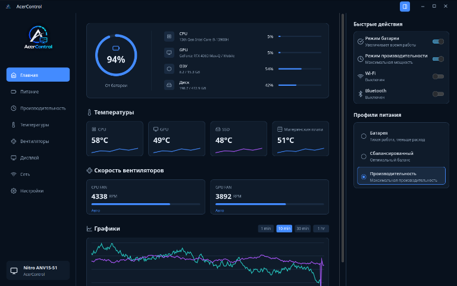
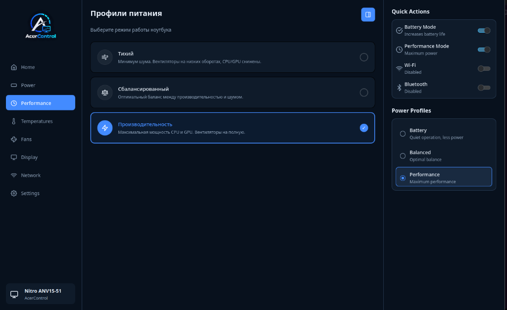

# AcerControl

<p align="center">
  
</p>

<p align="center">
  <strong>Native, modern, and lightning-fast Linux Control Center for Acer Nitro & Predator laptops.</strong>
</p>

<p align="center">
  
  
  
  
  
</p>

---

## ✨ Overview

**AcerControl** is a native, modern control center designed specifically for Acer laptops (Nitro and Predator series) running Linux. Built with a modular architecture featuring a high-performance **Rust** background daemon and a sleek **Qt 6 / QML** graphical interface, AcerControl provides comprehensive hardware control, real-time monitoring, and hardware hotkey support without bloat.

<p align="center">
  
</p>

---

## 📸 Screenshots

| Dashboard & Telemetry | Power & Performance Profiles |
|:---:|:---:|
|  |  |

<details>
  <summary><strong>🔍 Click to view more screenshots (Display Settings)</strong></summary>
  <br>
  <p align="center">
    
  </p>
</details>

## 🚀 Features

- **⚡ Thermal Profiles & Performance Modes**
  - Switch effortlessly between **Quiet**, **Balanced**, **Performance**, and **Turbo** modes.
  - Dynamically updates fan profiles and power limits supported by your Acer BIOS/WMI.

- **🌀 Smart Fan Management**
  - Real-time CPU & GPU temperature and RPM telemetry.
  - One-click presets: **Auto**, **Max**, and **Custom manual speed controls**.

- **🔋 Battery Care & Health**
  - **80% Battery Charge Limit** to prolong battery longevity when plugged in.
  - Toggle USB charging while the laptop is suspended / asleep.

- **⌨️ Keyboard & Lighting**
  - Keyboard backlight illumination controls.
  - Customizable keyboard backlight sleep/timeout settings.

- **🎯 Native Hardware NitroSense/Acer Key Integration**
  - Instant hardware button detection (evdev event listener for scancodes `425` and `148`).
  - Pressing the dedicated **Nitro / Acer** key seamlessly toggles or launches the application, even when it is completely closed!

- **🖥️ Display & System Diagnostics**
  - Monitor brightness, refresh rates, and resolution switching.
  - Network throughput monitor with quick Wi-Fi / Bluetooth toggles.
  - One-click RAM cache cleaner (`drop_caches`).

- **📦 System Tray & Background Daemon**
  - Unobtrusive system tray icon with quick actions (Show/Hide, Quit).
  - Background service runs as a lightweight `systemd` daemon communicating over a fast Unix domain socket.

- **💻 CLI Utility Included**
  - Full-featured command-line interface (`acercontrol`) for scripting, automations, and terminal enthusiasts.

- **🌍 Multilingual Interface**
  - Built-in support for **English** and **Russian** languages.

---

## 🛠️ Architecture

AcerControl uses a decoupled client-server architecture:

```
┌────────────────────────────────┐       ┌───────────────────────────────┐
│     acercontrol-gui (Qt6)      │       │     acercontrol-cli (Rust)    │
└───────────────┬────────────────┘       └───────────────┬───────────────┘
                │                                        │
                └───────────────┐        ┌───────────────┘
                                ▼        ▼
                     Unix Socket (/run/acercontrol/daemon.sock)
                                │
                                ▼
                ┌────────────────────────────────┐
                │   acercontrol-daemon (Rust)    │
                └───────────────┬────────────────┘
                                │
                                ▼
         Kernel Modules & Sysfs (/sys, linuwu-sense, acer-wmi)
```

---

## 📋 Requirements

### System Requirements
- Linux kernel 6.x or newer
- Acer Nitro or Predator laptop
- Recommended: [`linuwu-sense`](https://github.com/RowanChapple/linuwu-sense) kernel module or active `acer-wmi` driver

### Build Dependencies
- **Rust toolchain** (Cargo, rustc >= 1.75)
- **CMake** (>= 3.16)
- **C++17 compiler** (gcc or clang)
- **Qt 6** (`qt6-base`, `qt6-declarative`, `qt6-svg`, `qt6-tools`)
- Build essentials: `make`, `pkg-config`

#### Arch Linux / Manjaro
```bash
sudo pacman -S --needed base-devel git cmake rust qt6-base qt6-declarative qt6-svg qt6-tools
```

#### Ubuntu / Debian
```bash
sudo apt update
sudo apt install build-essential cmake cargo rustc qt6-base-dev qt6-declarative-dev libqt6svg6-dev qt6-tools-dev
```

#### Fedora
```bash
sudo dnf install @development-tools cmake cargo rust qt6-qtbase-devel qt6-qtdeclarative-devel qt6-qtsvg-devel qt6-qttools-devel
```

---

## 📥 Installation

### Interactive Setup (Recommended)

Clone the repository and run the interactive setup script:

```bash
git clone https://github.com/sh1tpostkun/acer-control.git
cd acer-control
chmod +x setup.sh
./setup.sh
```

Choose from the interactive menu:
- `1` → **Install** (Builds binaries and sets up systemd service, desktop shortcut, icons, and permissions)
- `2` → **Uninstall** (Completely removes binaries, configs, and systemd services)
- `4` → **Reinstall / Update** (Rebuilds and refreshes existing installation)

---

### Manual Build & Installation

If you prefer building manually:

```bash
# 1. Build all components (Rust daemon, CLI, Qt GUI)
./build.sh

# 2. Install to system
sudo ./install.sh
```

Check the status of the background daemon:
```bash
systemctl status acercontrol.service
```

---

## ⌨️ CLI Usage

AcerControl includes a fast command-line tool `acercontrol`:

```bash
# Get system telemetry & temperatures
acercontrol status

# Set thermal profile
acercontrol profile performance

# Set fan speeds (Auto / Max)
acercontrol fans auto
acercontrol fans max

# Set battery charging limit (80%)
acercontrol battery --limit 80
```

---

## 🗑️ Uninstallation

To remove AcerControl from your system:

```bash
./setup.sh
# Select option 2
```
or manually:
```bash
sudo ./uninstall.sh
```

---

## 🤝 Contributing

Contributions, bug reports, and hardware compatibility feedback are always welcome!

1. Fork the Project
2. Create your Feature Branch (`git checkout -b feature/AmazingFeature`)
3. Commit your Changes (`git commit -m 'Add some AmazingFeature'`)
4. Push to the Branch (`git push origin feature/AmazingFeature`)
5. Open a Pull Request

---

## 👤 Author

- **GitHub:** [@sh1tpostkun](https://github.com/sh1tpostkun)
- **Repository:** [https://github.com/sh1tpostkun/acer-control](https://github.com/sh1tpostkun/acer-control)

---

## 📄 License

This project is licensed under the **GNU General Public License v3.0 (GPL-3.0)** — see the [LICENSE](LICENSE) file for details.

---

<p align="center">
  Made with ❤️ for the Linux & Acer Community
</p>
